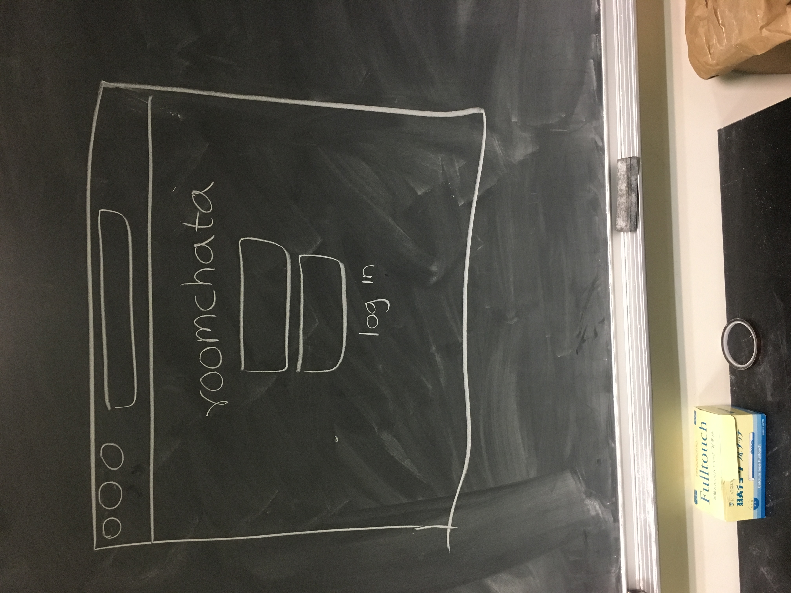
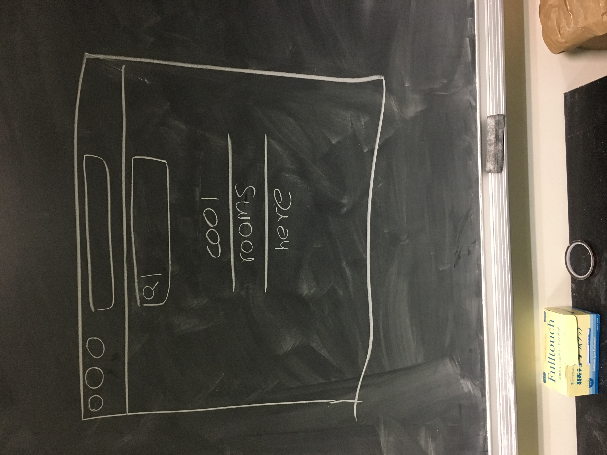
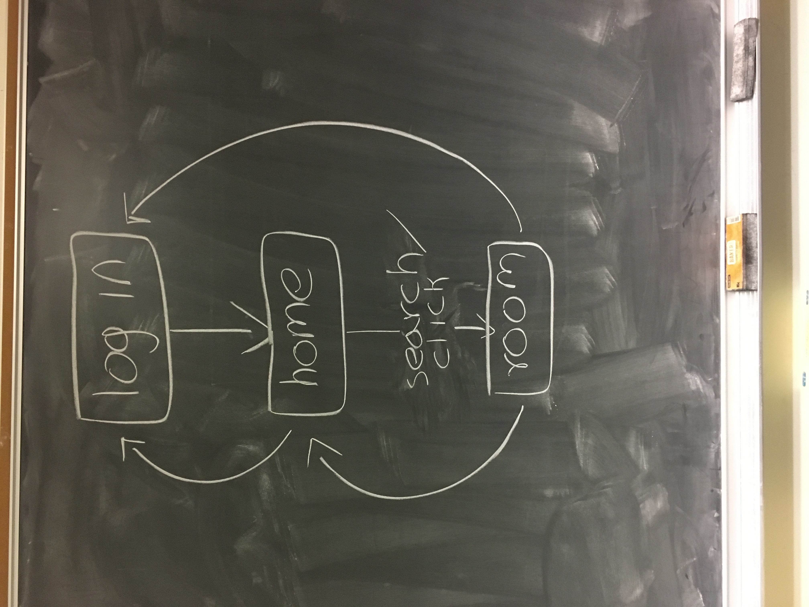

# Roomchata

## Overview

Talking to people you know is more fun than talking to people you do know. Use roomchata to talk
to people you would already be talking to on messenger. This is basically a bad messenger clone. Have fun.

## Data Model

Roomchata will store users and messages

* users can message multiple people (via references)
* conversations can have multiple messages in them (by embedding)

An Example User:
```javascript
{
    username: // a user defined username,
    inconspicuous: // a password hash,
    conversations: // an object of references to conversations the user has
}
```

An Example Conversation:
```javascript
{
    message_id: { // an object keeping track of the message metadata
        sender: // the name of the sender
        text: // the message text
    }
}
```

An Example Message:
```javascript
{
    sender: // the name of the sender
    text: // the message text
}
```

An Example Conversation with Embedded Items:

```javascript
{
    'conversation_id': {
        '2017-11-02 10:26:47 PM EST': {
            'sender': 'ait student 69',
            'message': 'wao thz prjct z s fn'
        },
        '2017-11-02 10:16:37 PM EST': {
            'sender': 'ait student 69',
            'message': 'i lrv ait'
        }
    }
}
```

## [Link to Commented First Draft Schema](src/db.js)

## Wireframes

/ - the login page



/home - a landing page showing the rooms you belong to and a search function that creates rooms if they don't exist



/room - the room's chat history and a place to send a message to the room


## Site map



## User Stories or Use Cases

1. as non-registered user, I can register a new account with the site
2. as a user, I can log in to the site
3. as a user, I can create a new conversation
4. as a user, I can go read the chat history of conversations I belong to
5. as a user, I can send new messages to a conversation

## Research Topics

* (5 points) Integrate user authentication
    * I'm going to be using passport for user authentication
    * make an account by signing up or log in with username `jeremy@muhia.com` and password `password69`
    * see `roomchata.herokuapp.com` for login page
* (2 points) React.js
    * used React.js as the frontend framework; it's a challenging library to learn, so I've assigned it 2 points
* (5 points) Firebase
    * used Firebase as the database because it has built in database listeners

12 points total out of 8 required points

## [Link to Initial Main Project File](src/app.js)

## Annotations / References Used

1. [passport.js authentication docs](http://passportjs.org/docs)
2. [tutorial on React.js](https://reactjs.org/tutorial/tutorial.html)
3. [firebase documentation](https://firebase.google.com/docs/reference/js/)
